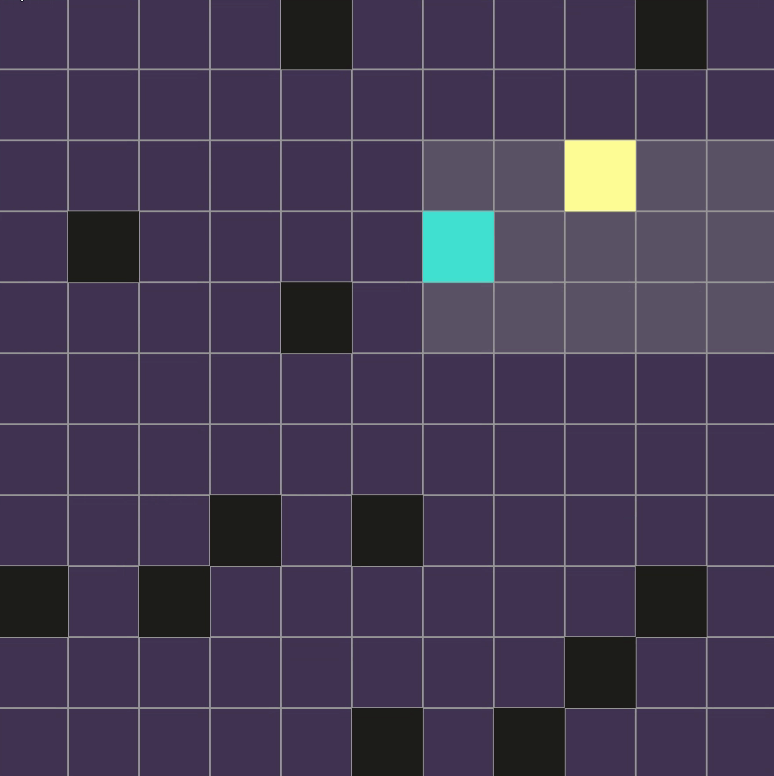
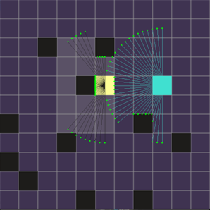
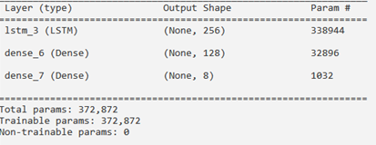
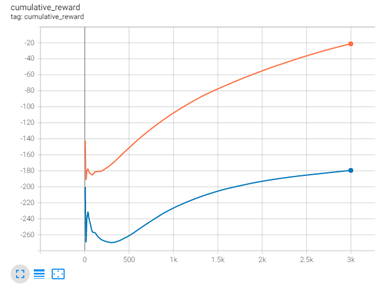
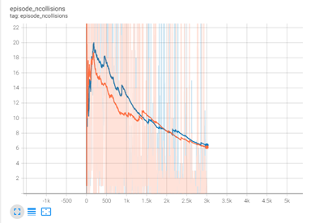

<div align="center">
  
  <h1>Seek: A Multi Agent Environment </h1>

</div>

<div align="justify">

## About

The purpose of this project is to study emergent competitive strategies between agents controlled by autonomous [Deep Recurrent Q-Networks](https://arxiv.org/abs/1507.06527) (DRQN). More particularly, the investigation will be carried out within a custom-built environment where two agents, a Seeker and a Hider, will play a version of the pursuit-evasion game.

## Stack

- Multi agent reinforcement learning
- Deep Recurrent Q-Network
- Decayed psilon greedy policy
- Replay buffer
- OpenAI Gym
- Tensorflow
- Pygame

## Project structure

```
$PROJECT_ROOT
│   # Readme utilities
├── screenshots
│   # Key scripts
└─┬ src
  │   # Training logs (using Tensorboard)
  ├── logs
  │   # Saved models (~3K epochs)
  ├── models
  │   # Starting file
  ├── main.py
  │   # Game environment
  ├── game.py
  │   # Environment handler
  ├── maenv.py
  │   # Replay buffer component
  ├── replay_buffer.py
  │   # Small utility for finding optimal epsilon value
  ├── epsilon.py
  │   # DRQN
  └── drqn.py
```

## Roadmap

- [x] Design game with manual inputs
- [x] Decide on algorithm and components to be used
- [x] Train and test the model
- [ ] Fix environment problems discussed in Evaluation section
- [ ] Furhter increase the training time and analyse new results
- [ ] Improve project scalability (i.e., number of agents, grid size)
- [ ] Implement a prioritised experience replay
- [ ] Investigate different algorithms and reward schemes
- [ ] Create different files for training and testing
  - Right now, the application is constantly training
  - Moreover, the exploration/exploitation phase needs to be manually changed
    in order to see if the agents are learning anything

## Highlights

<div align="center">
  
</div>

## Methodology

Two agents, a Seeker (yellow) and a Hider (light blue) are placed within an _11x11_ grid world at random locations. Moreover, 15 walls are also randomly generated at the start of each episode. The action of each agent is defined by a Discrete(8) Gym variable, consisting of rotation (up, down, left, right) and motion (stop, move forward). The observation of each agent does not give it full knowledge about the current state of the environment. More particularly, it only consists of limited data obtained through their personal radar. The latter is defined by a Box(37, 2) Gym variable, and will be discussed more in depth in the design section.

With that being said, each agent makes use of two DRQN networks, a main one for estimating the Q value, and a target one which is used to update the main one after a certain number of episodes with the intention of reducing fluctuations and achieve more stable training. This decision of using separate DRQNs for each agent, thereby using the environment as the only source of interaction between them, is mainly attributed to its simplicity, and decentralised nature. Networks aside, each agent also makes use of two other main components, a decayedepsilon-greedy policy, and a replay buffer (or experience replay). By using the former, each agent’s policy is initially set to a relatively high number, indicating the probability for which its action will be randomly selected from the action space. Following this, it gradually decays until it reaches a minimum amount, helping us achieve the optimal trade-off between exploration and exploitation. The latter, on the other hand, is used to store the agents’ transitions and randomly select them during the training process. More specifically, its purpose is to avoid highly correlated training samples thus improving the convergence of the main network.

Compared to DQNs, DRQNs have been proved to properly converge, even when full information about the environment was not available. This is accomplished by storing previous observations for a number of timesteps thus allowing the agent to learn from the environment. More particularly, the main difference between the two algorithms is that, in DRQNs, an LSTM layer is introduced after the input layer, with the main idea that there is something that can be learnt from a sequence of observations.

## Design

The first step to successfully carry out this project was to build the environment where the
agents would have operated in. At this stage, properly designing things such as action space,
observation space, and reward scheme was essential.

In order to implement our system, we made use of Python’s pygame library and TensorFlow. Each row of the agent’s observation space sees approximately 5° (for a total of 180°) and returns the first object the ray met in that direction and its distancethe agent (_Figure 1_).

<div align="center">
  
  <br>
  <br>
  <p style="font-size: 13; font-style: italic;">Figure 1: A visual representation of the radar as well as the overall environment.</p>
</div>

More particularly, the radar implementation is designed as follows:

- Draw a ray from agent’s location (x, y) to (x + MAX_DISTANCE_cos(angle), y +
  MAX_DISTANCE_sin(angle))
- Find the first intersection and return its distance from the agent and object type
  (WALL/OPPONENT)
- If no object is detected, return (MAX_DISTANCE, EMPTY)

Following this, it was time to decide the reward scheme that would have been used (_Table 1_). A lot of testing has been carried out with regards to this matter. It was critical to find the perfect balance between a) number of rewards and b) how much each agent was rewarded, in order for our agents to be able to learn the right things. For instance, during some initial experiments, the seeker was given a negative reward (i.e., -1) for distance travelled and a smaller one for not moving during each timestep (i.e., -0.1). However, this subsequently led the seeker to learn that the way to maximise its reward was by standing still, which was to be considered as a failure.

<div align="center">

| Description                                                                       | Seeker | Hider |
| :-------------------------------------------------------------------------------- | :----: | ----: |
| Wall collision                                                                    |   -2   |    -2 |
| Distance travelled                                                                |   -1   |    +1 |
| No movement performed                                                             |   -3   |    -3 |
| Hider caught                                                                      |  +100  |  -100 |
| If opponent is inside radar and distance is bigger than 2 cells in size           | +0.25  | -0.25 |
| If opponent is inside radar and distance is smaller than 2 cells in size          |  +0.5  |  -0.5 |
| If opponent was inside radar, and it is not anymore                               |   -5   |    +5 |
| If opponent was inside radar, and now the distance is smaller than 1 cell in size |  +2.5  |  -2.5 |

<p style="font-size: 13; font-style: italic;">Table 1: Reward scheme for our environment.</p>
</div>

## Implementation

As previously stated, each agent uses two DRQN networks, a main one and a target one. Both are made up of an Input, an LSTM, and two Dense layers, with size 128 and 8 (dimension of the action space), respectively. Moreover, the Input layer is made up of the 20 previous observations, whilst the LSTM layer has a size of 256. A visual representation can be seen in _Figure 2_:

<div align="center">
  
  <br>
  <br>
  <p style="font-size: 13; font-style: italic;">Figure 2: Deep Recurrent Q-Network architecture</p>
</div>

With that being said, a wide variety of hyper-parameters’ optimisation experiments were carried out, and we found the “optimal” ones to be the following:

<div align="center">

| Hyperparameter       | Value  |                                           Description |
| :------------------- | :----: | ----------------------------------------------------: |
| Max train iterations |  3000  |                        The maximum number of episodes |
| Max tries            |  400   |          Maximum number of timesteps for each episode |
| Batch size           |  128   |                 Number of training samples per update |
| Buffer size          | 50000  |                 Size of the experience replay dataset |
| Learning rate        | 0.0003 |                            Rate used by the optimiser |
| Update rule          |  ADAM  |       The parameter update rule used by the optimiser |
| Initial ℰ            |  1.0   |            Initial ℰ value in decayed ℰ greedy policy |
| Minimum ℰ            |  0.05  |                    Minimum ℰ value (~67% exploration) |
| ℰ decay              | 0.9985 |                             Rate at which ℰ decreases |
| Timesteps            |   20   |                Number of previous observations stored |
| Gamma                |  0.99  |                How much the future rewarded is valued |
| Target update        |   10   | After how many episodes the target network is updated |
| Replay iterations    |   10   |              How long the main network is trained for |

<p style="font-size: 13; font-style: italic;">Table 2: Deep Recurrent Q-Network hyperparameters and experimental settings.</p>
</div>

## Evaluation

In order to evaluate our two agents, we decided on observing the returned average cumulative reward instead of creating a new environment. The reason behind this is that the mentioned metric is considered to be satisfactory for understanding whether an agent is improving or not. Moreover, even after 3K episodes (ℰ min achieved at ~2K) our agents’ models still have not completely converged, proving that longer training is required. Nevertheless, the cumulative reward of both agents is showing an upward trend, indicating that they are learning (_Figure 5_). Both Seeker and Hider learnt to efficiently explore the environment (_Figure 6_). Moreover, the Seeker is learning to effectively catch the Hider within a minimal number of steps, whilst the Hider is learning how to increase its reward by moving as often as possible, and also evade the Seeker. With that being said, all of the metrics considered for the evaluation process overall show signs of learning.

<div align="center">
  
  <br>
  <br>
  <p style="font-size: 13; font-style: italic;">Figure 5: The average cumulative reward for both agents across 3K episodes. Hider in orange, Seeker in blue.</p>

  
  <br>
  <br>
  <p style="font-size: 13; font-style: italic;">Figure 6: The number of collisions for each episode. Hider in orange, Seeker in blue.</p>
</div>

Although I am definitely satisfied with the final software and results, there are a number of flaws which are mainly design related. More particularly, there are two key issues with regards to the environment itself which could have affected the final learning process. Until proven otherwise, we must assume that they did. The following are:

- sometimes the agents are given a reward (i.e., seeker within hider radar), even if there is a wall between them, as long as they are right next to the wall. This, unfortunately, happens due to the way the entire game was built (i.e., parallel lines problem).
- agents can effectively spawn entirely surrounded by walls, leading to a “useless” episode. This is one of the reasons why we had to introduce a max timesteps variable for each episode.

An exhaustive re-evaluation of the overall design, as well as a further increase with regards to the training length and the number of agents for each team is left as future work. With more particular regards to the latter, different algorithms and reward schemes (i.e., individual vs group-based) are to be investigated. While there several possible adaptations of the Q-Learning algorithm for the multi-agent domain, the one that has been used in this project can be considered relatively simple, and although it provides us with the ability to train agents that have to deal with partially observable environments, it has certain limitations. Our agents are trained using only a limited history of states, meaning that if we would want to further increase the size of our environment, they will not be able to learn the long-term dependencies which exceed the specified history length. Moreover, all states are also stored in the replay memory in order to train the networks, thus drastically increasing its size and the slowness of learning. In this case, other approaches could be taken such as implementing a prioritised experience replay, which has shown to improve the learning process.

## License

[MIT](https://github.com/1391819/MA-seek/blob/main/License.txt) © [Roberto Nacu](https://github.com/1391819)

## Attributions

- <a href="https://www.flaticon.com/free-icons/reinforcement" title="Reinforcement icons">Reinforcement icons created by Flat-icons-com - Flaticon</a>

</div>
